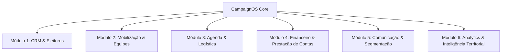
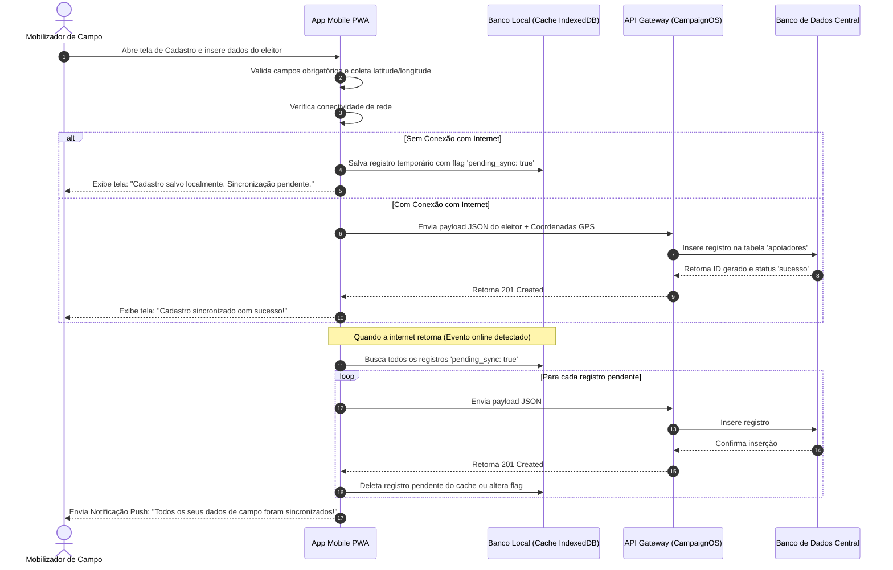
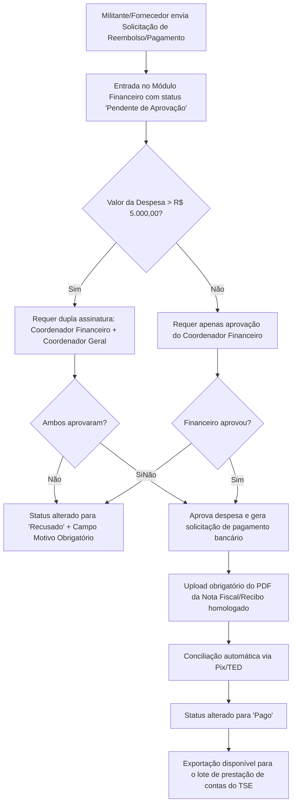
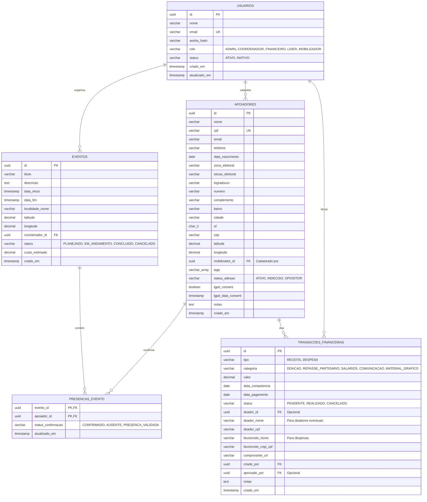

# Product Requirements Document (PRD) — CampaignOS

**Versão:** 1.0.0  
**Data:** 6 de Agosto de 2026  
**Status:** Em Revisão (Planejamento)  
**Autor:** Antigravity (Product Manager)  
**Projeto:** CampaignOS  

---

## 1. Visão Geral e Objetivos do Sistema

### 1.1. Contexto do Mercado
As campanhas eleitorais e movimentos de mobilização política modernos sofrem com a descentralização de informações. Dados de apoiadores são frequentemente armazenados em planilhas dispersas, agendas de candidatos sofrem com conflitos de logística, a captação de recursos falha por falta de transparência, e as equipes de campo não possuem ferramentas em tempo real para mapear o eleitorado. O **CampaignOS** surge para solucionar essas dores, consolidando-se como um "Sistema Operacional" completo para campanhas políticas e mandatos parlamentares.

### 1.2. Objetivos Principais
*   **Centralização de Dados (CRM Eleitoral):** Reunir informações cadastrais, preferências políticas, histórico de interações e dados territoriais de apoiadores e eleitores em uma única base de dados unificada, respeitando estritamente a LGPD.
*   **Gestão de Equipes e Mobilização Territorial:** Coordenar e rastrear o trabalho de voluntários, militantes e líderes de bairro em campo, otimizando a distribuição de material de campanha e a coleta de assinaturas/pesquisas.
*   **Logística e Agenda Eficiente:** Controlar a agenda de eventos públicos e reuniões privadas do candidato, cruzando a agenda com mapas de calor de apoio para otimizar o tempo e o deslocamento.
*   **Conformidade Financeira e Transparência:** Organizar as receitas (doações individuais, crowdfunding) e despesas de campanha, gerando relatórios consistentes que auxiliem na prestação de contas parcial e final junto aos órgãos eleitorais (ex: TSE).
*   **Comunicação Segmentada:** Integrar canais de disparo (WhatsApp, SMS e E-mail) para atingir os eleitores certos com base em sua localização, interesses e faixa etária.

---

## 2. Público-Alvo e Personas

### 2.1. Público-Alvo
*   Partidos Políticos que buscam profissionalizar a gestão de seus diretórios e candidatos.
*   Candidatos a cargos majoritários (Prefeito, Governador, Senador, Presidente) e proporcionais (Vereador, Deputado Estadual/Distrital, Deputado Federal).
*   Mandatos parlamentares ativos que desejam manter o relacionamento com sua base de eleitores durante o exercício do cargo.
*   Agências de consultoria e marketing político.

### 2.2. Personas

```
+---------------------------------------------------------------------------------+
| Persona 1: Dr. Roberto Mendes (52 anos) - O Candidato Majoritário               |
+---------------------------------------------------------------------------------+
| Perfil: Advogado renomado, concorrendo à prefeitura de uma cidade média-grande.  |
| Comportamento: Agenda extremamente cheia, foco em debates e discursos. Não tem   |
| tempo para aprender ferramentas complexas. Consome dados via dashboards resumidos.|
| Necessidades:                                                                   |
|  - Acesso mobile rápido a compromissos diários e informações do local do evento.|
|  - Visão geral do orçamento de campanha e projeção de votos por região.         |
| Dores: Falta de clareza se sua agenda está cobrindo as áreas mais críticas;     |
| medo de ter problemas de conformidade financeira com a prestação de contas.     |
+---------------------------------------------------------------------------------+

+---------------------------------------------------------------------------------+
| Persona 2: Mariana Costa (38 anos) - A Coordenadora Geral de Campanha           |
+---------------------------------------------------------------------------------+
| Perfil: Profissional de marketing político e gestão de projetos públicos.        |
| Comportamento: Extremamente organizada, analítica, cobra metas diariamente.     |
| Necessidades:                                                                   |
|  - Atribuir metas geográficas para os líderes de mobilização.                   |
|  - Monitorar a produtividade de voluntários em campo e taxa de conversão.       |
|  - Relatórios de doações e despesas consolidados em tempo real.                 |
| Dores: Descentralização de planilhas de voluntários, perda de contatos de       |
| apoiadores estratégicos e falhas de comunicação entre a rua e o QG.            |
+---------------------------------------------------------------------------------+

+---------------------------------------------------------------------------------+
| Persona 3: João Silva (22 anos) - O Mobilizador de Campo / Voluntário           |
+---------------------------------------------------------------------------------+
| Perfil: Estudante universitário de ciências sociais, engajado no projeto.       |
| Comportamento: Jovem, nativo digital, utiliza o smartphone para tudo.           |
| Necessidades:                                                                   |
|  - Ferramenta mobile rápida para cadastrar novos eleitores na rua.              |
|  - Roteiro claro de onde deve ir coletar assinaturas ou distribuir panfletos.   |
|  - Facilidade de coletar feedbacks e relatar problemas do local da visita.      |
| Dores: Formulários de papel que molham, rasgam ou têm escrita ilegível; falta de |
| clareza sobre qual região de bairro precisa de mais visitas.                   |
+---------------------------------------------------------------------------------+

+---------------------------------------------------------------------------------+
| Persona 4: Carlos "Carlinhos" Rocha (45 anos) - O Coordenador Financeiro        |
+---------------------------------------------------------------------------------+
| Perfil: Contador com especialização em direito e contabilidade eleitoral.       |
| Comportamento: Conservador, detalhista, focado em regras e conformidade fiscal.  |
| Necessidades:                                                                   |
|  - Fluxo rígido de aprovação de despesas.                                       |
|  - Registro preciso de dados de doadores (CPF, endereço, limites legais).       |
|  - Exportação de dados formatada para o software oficial de prestação de contas.|
| Dores: Gastos sem nota fiscal realizados pela equipe de rua; doações sem        |
| identificação de CPF válida que podem invalidar a campanha.                    |
+---------------------------------------------------------------------------------+
```

---

## 3. Módulos do Sistema

O CampaignOS é estruturado em **6 módulos centrais** integrados:



### 3.1. Módulo 1: CRM & Eleitores
*   Cadastro completo de cidadãos, apoiadores históricos e lideranças comunitárias.
*   Segmentação avançada por tags (ex: "Liderança de Bairro", "Estudante", "Causa Animal", "Saúde").
*   Histórico de interações: atendimentos, reuniões que participou, materiais recebidos.
*   Controle de consentimento explícito para conformidade com a LGPD (Lei Geral de Proteção de Dados).

### 3.2. Módulo 2: Mobilização & Equipes
*   Gestão de usuários (Militantes, Voluntários, Coordenadores, Administradores).
*   Divisão de equipes por zonas geográficas ou frentes temáticas.
*   Atribuição de missões de campo (ex: "Mutirão de Panfletagem no Bairro Centro").
*   Coleta de dados offline via aplicativo móvel (Web Progressive App - PWA) com posterior sincronização.

### 3.3. Módulo 3: Agenda & Logística
*   Calendário integrado do candidato, vice-candidato e principais porta-vozes.
*   Georreferenciamento de eventos (associação de endereços físicos para traçar rotas eficientes).
*   Controle de presença de convidados em reuniões e plenárias.
*   Lista de tarefas vinculadas a cada evento (ex: aluguel de som, compra de água, contratação de fotógrafo).

### 3.4. Módulo 4: Financeiro & Prestação de Contas
*   Fluxo de caixa de campanha: Contas a pagar, contas a receber e conciliação bancária.
*   Módulo de arrecadação online (integração com provedores de Pix e cartões para vaquinhas virtuais homologadas).
*   Geração de Recibos Eleitorais automáticos vinculados ao CPF do doador.
*   Validação de limites legais de doação de pessoa física (10% dos rendimentos brutos do ano anterior).

### 3.5. Módulo 5: Comunicação & Segmentação
*   Gestão de templates de mensagens (WhatsApp, SMS, E-mail).
*   Disparos direcionados com base em critérios de busca (ex: enviar SMS apenas para apoiadores que moram no Bairro X e têm interesse em "Educação").
*   Integração via API com brokers de WhatsApp (Z-API, Evolution API ou oficiais) para automações de atendimento receptivo (chatbots de campanha).

### 3.6. Módulo 6: Analytics & Inteligência Territorial
*   Mapas de calor mostrando a densidade de apoiadores em relação ao histórico de votação da zona eleitoral.
*   Projeção e simulação de votação com base em metas definidas pelo partido.
*   Dashboard executivo consolidando receitas versus despesas e o desempenho das equipes de rua.

---

## 4. Casos de Uso (Use Cases)

Abaixo estão detalhados os principais casos de uso operacionais do sistema.

### UC01: Cadastro de Apoiador em Campo (App PWA)
*   **Ator Principal:** Mobilizador de Campo.
*   **Pré-condições:** O mobilizador deve estar autenticado no aplicativo mobile do CampaignOS.
*   **Fluxo Principal:**
    1.  O Mobilizador aborda o cidadão na rua durante a panfletagem e solicita permissão para coletar dados.
    2.  O Mobilizador abre o aplicativo e seleciona "Novo Apoiador".
    3.  Preenche os campos básicos: Nome, WhatsApp, E-mail, Data de Nascimento e Bairro.
    4.  Associa tags de interesse que o cidadão manifestar (ex: "Esportes", "Segurança").
    5.  O aplicativo coleta automaticamente as coordenadas de geolocalização do dispositivo (com consentimento do usuário).
    6.  O cidadão lê a cláusula de proteção de dados (LGPD) apresentada na tela e assina digitalmente (desenho na tela ou opt-in via SMS/WhatsApp posterior).
    7.  O Mobilizador salva o cadastro. Se houver conexão com a internet, o registro vai para o banco central; caso contrário, fica salvo no cache local (IndexedDB) para envio posterior.
*   **Pós-condições:** O apoiador é cadastrado na base central e recebe uma mensagem automática de boas-vindas via WhatsApp.

### UC02: Planejamento de Reunião de Bairro Georreferenciada
*   **Ator Principal:** Coordenador Geral de Campanha.
*   **Pré-condições:** O coordenador deve estar autenticado no painel web administrativo.
*   **Fluxo Principal:**
    1.  O Coordenador visualiza o mapa de calor da cidade e identifica que o "Bairro Vila Nova" possui baixa densidade de apoiadores cadastrados, apesar de ser um reduto eleitoral histórico.
    2.  Cria um novo Evento no sistema: Tipo "Reunião de Bairro", título "Roda de Conversa na Vila Nova".
    3.  Define data, horário, local (com autocompletar via Google Maps API) e capacidade.
    4.  Vincula o candidato da campanha como participante obrigatório.
    5.  Filtra no CRM todos os apoiadores que moram em um raio de 2km do local do evento.
    6.  Dispara um convite segmentado via WhatsApp/SMS contendo a localização e o link para confirmação de presença.
    7.  Gerencia as tarefas pré-evento: "Reservar salão comunitário", "Levar material gráfico".
*   **Pós-condições:** O evento é adicionado à agenda pública do candidato e as confirmações de presença são rastreadas em tempo real.

### UC03: Doação via Pix e Emissão de Recibo Eleitoral
*   **Ator Principal:** Doador (Eleitor) e Coordenador Financeiro.
*   **Pré-condições:** O doador acessa a página de arrecadação pública da campanha. O sistema financeiro está integrado com um gateway de pagamentos autorizado para doação de campanha.
*   **Fluxo Principal:**
    1.  O Doador insere seu CPF, Nome Completo, E-mail, Endereço de Residência e declara que os recursos são próprios e respeitam o limite de 10% de seus rendimentos do ano fiscal anterior.
    2.  O sistema realiza uma consulta rápida automática de regularidade do CPF junto à API da Receita Federal.
    3.  Se o CPF estiver regular, o sistema gera uma chave Pix Copia e Cola ou QR Code dinâmico para a transação.
    4.  O Doador realiza o pagamento em seu aplicativo bancário.
    5.  O gateway de pagamento processa a transação e envia uma notificação (Webhook) para o CampaignOS.
    6.  O CampaignOS altera o status da transação para "Confirmada".
    7.  O sistema gera um arquivo PDF do Recibo Eleitoral numerado seguindo as normas vigentes, assina digitalmente e envia por e-mail para o doador, arquivando uma cópia no painel financeiro da campanha.
*   **Pós-condições:** A receita é contabilizada na prestação de contas parcial da campanha e o valor é somado ao saldo líquido disponível.

---

## 5. Fluxos de Usuário (User Flows)

### 5.1. Fluxo do Mobilizador de Campo (Coleta Offline e Sincronização)



### 5.2. Fluxo do Coordenador Financeiro (Aprovação de Despesa de Campanha)



---

## 6. Modelo de Permissões (RBAC - Role-Based Access Control)

Para garantir a segurança dos dados dos eleitores (LGPD) e o sigilo estratégico da campanha, o sistema adota uma estrutura granular de permissões baseada nos papéis definidos a seguir:

*   **Administrador do Sistema (Admin):** Acesso irrestrito a todas as configurações, auditoria e módulos.
*   **Coordenador Geral (Coordenador):** Gerenciamento operacional total, monitoramento de metas, visualização de dashboards e aprovação de despesas.
*   **Coordenador Financeiro (Financeiro):** Acesso exclusivo para edição e inserção no módulo de receitas e despesas. Não possui permissão para visualizar cadastros detalhados de eleitores de campo, exceto dados de doadores.
*   **Líder de Mobilização (Líder):** Gerencia equipes de voluntários em uma região geográfica específica. Consegue visualizar e cadastrar eleitores da sua região, criar eventos locais e designar tarefas de campo.
*   **Mobilizador / Voluntário (Mobilizador):** Acesso restrito ao aplicativo mobile. Só pode cadastrar novos eleitores, marcar presença de pessoas em eventos específicos e visualizar suas próprias tarefas de campo atribuídas. Não visualiza a base completa de eleitores nem relatórios financeiros da campanha.

### 6.1. Matriz de Permissões

| Recurso / Módulo | Admin | Coordenador | Financeiro | Líder de Bairro | Mobilizador |
| :--- | :---: | :---: | :---: | :---: | :---: |
| **Configurações Gerais do Sistema** | CRUD | Nenhuma | Nenhuma | Nenhuma | Nenhuma |
| **Visualizar Dashboard Consolidado** | Sim | Sim | Apenas Finanças | Apenas Região | Não |
| **Visualizar Base Geral de Eleitores** | Sim | Sim | Não | Apenas Região | Não |
| **Cadastrar/Editar Eleitores** | CRUD | CRUD | Não | CRUD (Região) | Apenas Criar |
| **Excluir Eleitores** | Sim | Sim | Não | Não | Não |
| **Exportar Base de Eleitores (CSV)** | Sim | Sim | Não | Não | Não |
| **Criar Eventos de Campanha** | Sim | Sim | Não | Sim (Região) | Não |
| **Visualizar Agenda do Candidato** | Sim | Sim | Sim | Sim | Apenas Eventos Atribuídos |
| **Visualizar Lançamentos Financeiros**| Sim | Sim | CRUD | Não | Não |
| **Lançar Receitas / Despesas** | Sim | Não | CRUD | Não | Não |
| **Aprovar Despesas > R$ 5.000,00** | Sim | Sim | Sim | Não | Não |
| **Disparar Mensagens em Massa** | Sim | Sim | Não | Não | Não |
| **Visualizar Logs de Auditoria** | Sim | Não | Não | Não | Não |

*Legenda: **CRUD** (Create, Read, Update, Delete); **Sim** (Acesso total de leitura/escrita básico); **Não/Nenhuma** (Acesso bloqueado).*

---

## 7. Requisitos Funcionais (RF) e Critérios de Aceite

Abaixo estão listados os requisitos funcionais prioritários ordenados por relevância e agrupados por módulo.

### Módulo 1: CRM & Eleitores

#### RF001: Cadastro Unificado de Eleitores/Apoiadores
*   **Prioridade:** Must Have
*   **Descrição:** O sistema deve permitir o cadastro manual de eleitores e apoiadores, contendo informações sociodemográficas e políticas detalhadas.
*   **Critérios de Aceite:**
    *   **Cenário 1: Cadastro completo com dados válidos.**
        *   **Dado que** o usuário está na tela de "Novo Apoiador";
        *   **Quando** ele preenche o Nome completo, E-mail, Celular (com máscara e validação de DDD), CPF (válido por algoritmo), Data de Nascimento (idade deve ser maior ou igual a 16 anos), Bairro, Cidade, Zona Eleitoral e Seção Eleitoral;
        *   **E** clica em "Salvar";
        *   **Então** o sistema valida as informações, grava no banco de dados com data/hora do cadastro, gera um ID único e mostra a mensagem "Apoiador cadastrado com sucesso!".
    *   **Cenário 2: Duplicidade de CPF ou Telefone.**
        *   **Dado que** o usuário tenta cadastrar um apoiador com um CPF ou número de celular já existente na base;
        *   **Quando** ele clica em "Salvar";
        *   **Então** o sistema impede a gravação e apresenta um alerta: "Este CPF/Celular já está cadastrado no sistema. [Visualizar Cadastro Existente]".
    *   **Cenário 3: Consentimento LGPD.**
        *   **Dado que** o sistema obriga a conformidade de dados;
        *   **Quando** um cadastro de apoiador é criado;
        *   **Então** deve conter um campo booleano `lgpd_consent` registrado como `TRUE`, juntamente com a data, hora e o canal de captura do opt-in (ex: "Coletado em campo por Mobilizador João").

#### RF002: Segmentação Avançada e Tags Dinâmicas
*   **Prioridade:** Must Have
*   **Descrição:** O usuário deve conseguir criar "Tags" customizadas e aplicá-las a perfis de apoiadores para criar grupos de segmentação dinâmicos.
*   **Critérios de Aceite:**
    *   **Cenário 1: Criação de Tags e aplicação em lote.**
        *   **Dado que** o coordenador selecionou 15 apoiadores na listagem geral através de checkboxes;
        *   **Quando** ele seleciona a opção "Adicionar Tag", digita "Liderança Esportiva" e confirma;
        *   **Então** o sistema aplica a tag selecionada a todos os 15 perfis selecionados simultaneamente, atualizando o índice de busca em menos de 1 segundo.
    *   **Cenário 2: Filtro dinâmico por múltiplas tags.**
        *   **Dado que** o usuário está na tela de busca avançada;
        *   **Quando** ele filtra por Tag = "Saúde" E Bairro = "Vila Nova" E Status de Adesão = "Ativo";
        *   **Então** o sistema retorna apenas a lista de apoiadores que cumprem cumulativamente todas as condições especificadas.

---

### Módulo 2: Mobilização & Equipes

#### RF003: Geolocalização de Cadastros e Mapeamento
*   **Prioridade:** Should Have
*   **Descrição:** O sistema deve coletar a coordenada geográfica no momento de cadastros em campo (via app móvel) e plotá-la em um mapa administrativo na interface Web.
*   **Critérios de Aceite:**
    *   **Cenário 1: Captura de GPS ativa.**
        *   **Dado que** o aplicativo móvel do mobilizador está aberto e possui permissões de geolocalização ativas no navegador/PWA;
        *   **Quando** o mobilizador salva um novo cadastro;
        *   **Então** o sistema captura latitude e longitude com margem de precisão horizontal inferior a 30 metros e anexa essas coordenadas ao registro do apoiador.
    *   **Cenário 2: Visualização administrativa no mapa.**
        *   **Dado que** o Coordenador Geral está acessando a tela de Mapa de Mobilização;
        *   **Quando** ele seleciona um intervalo de datas e a tag "Apoiador Ativo";
        *   **Então** o sistema renderiza um mapa interativo com pins indicando onde cada apoiador foi cadastrado, agrupando os pontos (clusterização) em níveis baixos de zoom para evitar lentidão no browser.

---

### Módulo 3: Agenda & Logística

#### RF004: Gestão e Conflitos de Agenda do Candidato
*   **Prioridade:** Must Have
*   **Descrição:** O sistema deve fornecer um calendário centralizado da campanha e alertar automaticamente sobre conflitos de horários ou inviabilidades logísticas de deslocamento.
*   **Critérios de Aceite:**
    *   **Cenário 1: Cadastro de evento sem sobreposição.**
        *   **Dado que** a agenda do candidato está livre no dia 15/09/2026 das 14h às 16h;
        *   **Quando** o assessor cria um evento "Entrevista para Rádio Local" nesse exato período;
        *   **Então** o sistema salva o evento e notifica o candidato via e-mail/notificação push.
    *   **Cenário 2: Alerta de conflito de horário.**
        *   **Dado que** já existe um evento agendado para o candidato das 14h às 16h;
        *   **Quando** o assessor tenta salvar um segundo evento no mesmo dia das 15h às 17h;
        *   **Então** o sistema emite um alerta impeditivo: "Conflito de Horário detectado com o evento 'Entrevista para Rádio Local'. Escolha outro horário".
    *   **Cenário 3: Alerta de logística inviável.**
        *   **Dado que** o evento A termina às 15:00 na Zona Norte da cidade;
        *   **Quando** o assessor cadastra o evento B iniciando às 15:15 na Zona Sul (distância de 25km em trânsito urbano padrão);
        *   **Então** o sistema exibe um aviso amarelo (aviso de atenção, mas não impeditivo): "Aviso: O tempo de deslocamento calculado entre o evento A e o evento B é de aproximadamente 35 minutos. O candidato pode chegar atrasado."

---

### Módulo 4: Financeiro & Prestação de Contas

#### RF005: Controle de Doações e Limite de CPF
*   **Prioridade:** Must Have
*   **Descrição:** O sistema deve registrar as doações financeiras recebidas, validar a integridade dos dados fiscais do doador e emitir o recibo oficial de campanha.
*   **Critérios de Aceite:**
    *   **Cenário 1: Registro de Doação Pessoa Física.**
        *   **Dado que** o financeiro está registrando uma doação manual;
        *   **Quando** ele insere o CPF do doador e o valor da doação de R$ 1.500,00;
        *   **Então** o sistema realiza uma chamada de API para verificar se o CPF está cadastrado como regular no banco da Receita Federal e arquiva o comprovante bancário da transação.
    *   **Cenário 2: Emissão e numeração sequencial de Recibos.**
        *   **Dado que** a doação foi dada como confirmada (compensada);
        *   **Quando** o sistema atualiza o status para "Liquidada";
        *   **Então** o sistema deve gerar automaticamente um PDF contendo o CNPJ da campanha, identificação do Doador, CPF, Valor por extenso, Data e número sequencial do recibo eleitoral (ex: 2026-0001, 2026-0002), o qual não poderá ser editado ou excluído (imutável para fins de auditoria).

---

### Módulo 5: Comunicação & Segmentação

#### RF006: Disparo de Mensagens Segmentadas via Integração de API
*   **Prioridade:** Should Have
*   **Descrição:** O sistema deve criar filas de envio para mensagens SMS e WhatsApp personalizadas utilizando as segmentações configuradas no Módulo 1.
*   **Critérios de Aceite:**
    *   **Cenário 1: Envio personalizado com variáveis.**
        *   **Dado que** o usuário redigiu a mensagem: "Olá {primeiro_nome}, o candidato estará no bairro {bairro} amanhã às 19h! Venha conversar conosco.";
        *   **Quando** ele executa o disparo para a lista filtrada;
        *   **Então** a fila de envio substitui corretamente as variáveis de cada destinatário antes de realizar a requisição externa na API do broker de comunicação.
    *   **Cenário 2: Respeito à fila de vazão (Rate Limit) do WhatsApp.**
        *   **Dado que** a lista de disparo possui 5.000 contatos;
        *   **Quando** o disparo é iniciado;
        *   **Então** o sistema envia os pacotes em lotes de no máximo 20 mensagens por minuto (ou conforme as diretrizes do broker integrado) para mitigar o risco de banimento de número de telefone (antispam), exibindo uma barra de progresso em tempo real da transmissão.

---

### Módulo 6: Analytics & Inteligência Territorial

#### RF007: Projeção de Votação por Zonas e Seções Eleitorais
*   **Prioridade:** Could Have
*   **Descrição:** O sistema deve cruzar o número de apoiadores cadastrados ativos com os resultados históricos de eleições anteriores importados do TSE para gerar a projeção de votos necessários por zona.
*   **Critérios de Aceite:**
    *   **Cenário 1: Visualização da Projeção de Metas.**
        *   **Dado que** o diretório inseriu a meta global da campanha como 50.000 votos;
        *   **Quando** o usuário acessa o painel de Analytics Territorial;
        *   **Então** o sistema exibe gráficos de barras empilhadas mostrando a meta de votos estipulada para cada Zona Eleitoral contra o número atual de eleitores/apoiadores cadastrados na base, indicando a porcentagem de cobertura da meta.

---

## 8. Requisitos Não Funcionais (RNF)

Os requisitos não funcionais especificam os critérios operacionais de qualidade, infraestrutura, segurança e arquitetura do CampaignOS.

### RNF001: Segurança e Conformidade (LGPD & Criptografia)
*   **Tipo:** Segurança / Conformidade Legal.
*   **Descrição:** Todas as informações de eleitores coletadas devem seguir a LGPD. Dados sensíveis (como telefone, e-mail e dados de geolocalização) devem ser criptografados em trânsito (TLS 1.3) e em repouso (AES-256).
*   **Métrica:** Chaves de criptografia gerenciadas de forma independente (ex: AWS KMS). O banco de dados deve anonimizar automaticamente os dados de apoiadores que solicitarem exclusão de cadastro, restando apenas metadados agregados não identificáveis para estatísticas da campanha.

### RNF002: Desempenho e Latência
*   **Tipo:** Desempenho.
*   **Descrição:** O tempo de resposta das APIs de carregamento de listas de eleitores e carregamento de pins em mapas não deve comprometer a usabilidade do usuário.
*   **Métrica:** Tempo de resposta (Response Time) de 95% das consultas de busca e filtragem no CRM web deve ser inferior a 1.5 segundos para uma base de até 100.000 apoiadores ativos.

### RNF003: Disponibilidade e Tolerância a Falhas
*   **Tipo:** Disponibilidade.
*   **Descrição:** O sistema CampaignOS deve permanecer no ar mesmo durante os períodos de maior tráfego na reta final da campanha eleitoral.
*   **Métrica:** SLA mínimo de **99.9%** de uptime para a plataforma Web administrativa e APIs. Implementação de auto-scaling na nuvem capaz de suportar um aumento repentino de 10x no volume de requisições concorrentes na semana que antecede as eleições.

### RNF004: Portabilidade e Suporte Offline (PWA Mobile)
*   **Tipo:** Usabilidade / Portabilidade.
*   **Descrição:** O aplicativo de mobilização de campo deve ser um Progressive Web App (PWA) responsivo, funcionando em qualquer sistema operacional (Android, iOS) a partir do navegador web, com suporte a operação em modo totalmente offline.
*   **Métrica:** Capacidade de armazenar pelo menos 500 registros completos de apoiadores localmente no cache do navegador (IndexedDB) e sincronizar o lote pendente automaticamente assim que uma conexão à internet estável de pelo menos 3G for restabelecida.

---

## 9. Estrutura de Navegação (Sitemap & Arquitetura de Informação)

Estrutura visual dos caminhos do sistema para os ambientes Web Administrativo e App Mobile do Militante.

### 9.1. Painel Web Administrativo (Coordenadores/Admin)

```
[Main Layout (Sidebar + Header)]
 ├── Dashboard (Visão Geral da Campanha)
 ├── CRM Eleitores
 │    ├── Listar Apoiadores
 │    ├── Ficha Detalhada (Perfil)
 │    ├── Grupos & Segmentações
 │    └── Importação de Planilhas (CSV/XLSX)
 ├── Equipes & Mobilizadores
 │    ├── Gestão de Membros (Permissões)
 │    ├── Rotas & Missões de Campo
 │    └── Painel de Monitoramento GPS
 ├── Agenda & Eventos
 │    ├── Calendário Geral (Candidato/Equipes)
 │    ├── Novo Evento
 │    └── Controle de Presença / Logística
 ├── Módulo Financeiro
 │    ├── Fluxo de Caixa (Lançamentos)
 │    ├── Doações & Crowdfunding (Recibos Eleitorais)
 │    └── Relatório de Prestação de Contas
 ├── Comunicação
 │    ├── Campanhas de Disparo (SMS/WhatsApp/E-mail)
 │    ├── Histórico de Disparos
 │    └── Configurações de Integração de API (Brokers)
 └── Configurações
      ├── Dados da Campanha (CNPJ, Partido, Cargo)
      ├── Gerenciamento de Tags Customizadas
      └── Logs de Auditoria
```

### 9.2. Aplicativo Mobile PWA (Mobilizadores em Campo)

```
[Mobile Layout (Bottom Navigation)]
 ├── Home (Minhas Missões do Dia & Notificações)
 ├── Cadastrar (Formulário Rápido de Apoiador)
 ├── Meus Cadastros (Histórico de Eleitores Cadastrados localmente/sincronizados)
 ├── Agenda (Eventos Locais da Campanha que preciso apoiar)
 └── Perfil (Meus dados e botão para forçar Sincronização Manual)
```

---

## 10. Wireframes em ASCII

### 10.1. Dashboard Principal (Web)

```
+-----------------------------------------------------------------------------------------+
| [CampaignOS] v1.0.0    Candidato: Roberto Mendes | Prefeito          [Perfil] [Sair]   |
+-----------------------------------------------------------------------------------------+
| (o) Dashboard      |  PAINEL DE CONTROLE GERAL                                          |
| [ ] CRM Eleitores  |  +-------------------+  +-------------------+  +-----------------+ |
| [ ] Equipes        |  | TOTAL APOIADORES  |  | TOTAL ARRECADADO  |  | VOTOS PROJETADOS| |
| [ ] Agenda         |  | 14.520            |  | R$ 125.430,00     |  | 45.000 / 60.000 | |
| [ ] Financeiro     |  | [+ 12% esta sem]  |  | [78% da meta]     |  | [75% Concluído] | |
| [ ] Comunicação    |  +-------------------+  +-------------------+  +-----------------+ |
| [ ] Configurações  |                                                                    |
|                    |  DESEMPENHO DAS EQUIPES (META DE CADASTROS POR BAIRRO)             |
|                    |  Bairro Centro       [====================] 100% (Meta Atingida)  |
|                    |  Bairro Vila Nova    [==========..........] 50%  (Pendente)        |
|                    |  Bairro São José     [===============.....] 75%  (Pendente)        |
|                    |                                                                    |
|                    |  PRÓXIMOS COMPROMISSOS (AGENDA)                                    |
|                    |  * 18h00 - Caminhada no Calçadão do Centro (Zona Norte)            |
|                    |  * 20h30 - Jantar de Adesão com Empresários (Hotel Plaza)          |
+-----------------------------------------------------------------------------------------+
```

### 10.2. Ficha do Apoiador (CRM)

```
+-----------------------------------------------------------------------------------------+
| [CampaignOS] > CRM Eleitores > Ficha do Apoiador                                        |
+-----------------------------------------------------------------------------------------+
|  <- Voltar para Lista                                                                   |
|                                                                                         |
|  +-----------------------------------------------------------------------------------+  |
|  | DADOS PESSOAIS E ELEITORAIS                                                       |  |
|  | Nome: Maria do Carmo Oliveira           CPF: 123.456.789-00    Nasc: 12/04/1984   |  |
|  | Telefone: (11) 98765-4321               E-mail: maria.carmo@email.com             |  |
|  | Zona Eleitoral: 342                     Seção Eleitoral: 0145                     |  |
|  +-----------------------------------------------------------------------------------+  |
|  +-----------------------------------------------------------------------------------+  |
|  | ENDEREÇO                                                                          |  |
|  | Rua das Flores, 123 - Apto 42 - Vila Nova - São Paulo/SP - CEP: 01234-567          |  |
|  | Coordenadas GPS: Lat -23.5505 / Long -46.6333  (Mapa de localização: [Ver Mapa])  |  |
|  +-----------------------------------------------------------------------------------+  |
|  +-----------------------------------------------------------------------------------+  |
|  | INTERESSES E ADESÃO                                                               |  |
|  | Tags de Interesse: [Saúde x] [Educação x] [Esportes x] [+ Adicionar Tag]           |  |
|  | Status de Adesão: (o) Apoiador Ativo   ( ) Indeciso   ( ) Opositor                |  |
|  | Origem: Cadastrado em Campo por Mobilizador: João Silva (ID: 042)                 |  |
|  +-----------------------------------------------------------------------------------+  |
|  +-----------------------------------------------------------------------------------+  |
|  | LEGISLAÇÃO E LGPD                                                                 |  |
|  | [X] Consentimento LGPD ativo. Coletado em: 06/08/2026 às 15:40 via App Mobile.     |  |
|  +-----------------------------------------------------------------------------------+  |
|                                                                                         |
|  [Cancelar Edição]                                              [SALVAR ALTERAÇÕES]     |
+-----------------------------------------------------------------------------------------+
```

### 10.3. Interface Mobile PWA (Cadastro Rápido de Campo)

```
+------------------------------------------+
|  [CampaignOS Mobile]         [Sinc: OK]  |
+------------------------------------------+
|                                          |
|  CADASTRO DE APOIADOR                    |
|                                          |
|  Nome Completo*                          |
|  [ Maria do Carmo Oliveira             ] |
|                                          |
|  WhatsApp*                               |
|  [ (11) 98765-4321                     ] |
|                                          |
|  Bairro*                                 |
|  [ Vila Nova                           ] |
|                                          |
|  Interesses                              |
|  [X] Saúde   [ ] Educação   [X] Esporte  |
|                                          |
|  Assinatura Digital (Consentimento LGPD) |
|  +------------------------------------+  |
|  |                                    |  |
|  |          [Maria do Carmo]          |  |
|  |                                    |  |
|  +------------------------------------+  |
|  [Limpar]                                |
|                                          |
|  (*) Campos Obrigatórios                 |
|                                          |
|            [ SALVAR CADASTRO ]           |
|                                          |
+------------------------------------------+
|  [Home]   [*Cadastrar*]   [Meus Cad]   [=] |
+------------------------------------------+
```

---

## 11. Modelo de Banco de Dados Conceitual

O banco de dados do CampaignOS é estruturado de forma relacional, visando manter a integridade dos dados financeiros e cadastrais.

### 11.1. Diagrama de Relacionamento de Entidades (ER)



### 11.2. Dicionário de Dados

#### Tabela: `usuarios`
*   `id` (UUID, Primary Key, auto-gerado): Identificador único do usuário do sistema.
*   `nome` (VARCHAR(150), obrigatório): Nome completo do usuário/membro da equipe.
*   `email` (VARCHAR(100), obrigatório, único): E-mail para login no sistema.
*   `senha_hash` (VARCHAR(255), obrigatório): Hash criptográfico da senha (ex: bcrypt).
*   `role` (VARCHAR(30), obrigatório): Papel de permissão no sistema (ADMIN, COORDENADOR, FINANCEIRO, LIDER, MOBILIZADOR).
*   `status` (VARCHAR(20), padrão 'ATIVO'): Situação do usuário (ATIVO, INATIVO).

#### Tabela: `apoiadores`
*   `id` (UUID, Primary Key): Identificador único do eleitor.
*   `nome` (VARCHAR(150), obrigatório): Nome do eleitor.
*   `cpf` (VARCHAR(11), único, opcional): Cadastro de Pessoa Física para validação.
*   `email` (VARCHAR(100), opcional): Endereço de correio eletrônico.
*   `telefone` (VARCHAR(20), obrigatório): Telefone de contato (WhatsApp).
*   `data_nascimento` (DATE, opcional): Data de nascimento.
*   `zona_eleitoral` (VARCHAR(10), opcional): Zona Eleitoral do eleitor.
*   `secao_eleitoral` (VARCHAR(10), opcional): Seção Eleitoral do eleitor.
*   `bairro` (VARCHAR(100), obrigatório): Bairro do domicílio.
*   `latitude` / `longitude` (DECIMAL(10, 8) / (11, 8), opcional): Coordenadas GPS da residência ou do local de captação.
*   `tags` (ARRAY of VARCHAR, opcional): Interesses e marcas aplicadas ao apoiador.
*   `lgpd_consent` (BOOLEAN, padrão FALSE): Status de consentimento da LGPD.
*   `mobilizador_id` (UUID, Foreign Key referenciando `usuarios.id`): Usuário que realizou o cadastro.

#### Tabela: `transacoes_financeiras`
*   `id` (UUID, Primary Key): Identificador único da transação.
*   `tipo` (VARCHAR(10), obrigatório): RECEITA ou DESPESA.
*   `categoria` (VARCHAR(50), obrigatório): Classificação da transação para prestação de contas do TSE.
*   `valor` (NUMERIC(15, 2), obrigatório): Valor monetário da transação.
*   `data_pagamento` (DATE, opcional): Data em que a transação foi compensada ou realizada.
*   `doador_cpf` / `favorecido_cnpj_cpf` (VARCHAR(14), obrigatório): CPF/CNPJ da outra parte da transação para transparência contábil.
*   `comprovante_url` (VARCHAR(255), opcional): Link do S3/Cloud Storage do PDF da nota fiscal ou recibo.

---

## 12. APIs Previstas (Back-End)

Abaixo estão definidos os endpoints RESTful centrais para comunicação entre o front-end Web/Mobile e o servidor back-end.

### 12.1. Autenticação e Sessão
*   **POST** `/api/v1/auth/login`
    *   **Descrição:** Autentica o usuário e gera um Token JWT de acesso.
    *   **Request Body:**
        ```json
        {
          "email": "coordenador@campaignos.com",
          "senha": "SenhaForteSegura123!"
        }
        ```
    *   **Response (200 OK):**
        ```json
        {
          "token": "eyJhbGciOiJIUzI1NiIsInR5cCI6IkpXVCJ9...",
          "usuario": {
            "id": "a9b8c7d6-e5f4-3210-abcd-ef0123456789",
            "nome": "Mariana Costa",
            "role": "COORDENADOR"
          }
        }
        ```

### 12.2. Gestão de Apoiadores (CRM)
*   **POST** `/api/v1/apoiadores`
    *   **Descrição:** Cadastra um novo apoiador (suporta geolocalização e flag LGPD).
    *   **Request Body:**
        ```json
        {
          "nome": "Maria do Carmo Oliveira",
          "cpf": "12345678900",
          "telefone": "+5511987654321",
          "bairro": "Vila Nova",
          "latitude": -23.5505,
          "longitude": -46.6333,
          "tags": ["Saúde", "Esportes"],
          "lgpd_consent": true
        }
        ```
    *   **Response (201 Created):**
        ```json
        {
          "id": "f8a9b2c3-d4e5-4f6a-8b9c-0d1e2f3a4b5c",
          "status": "sucesso",
          "criado_em": "2026-08-06T17:30:00Z"
        }
        ```

*   **GET** `/api/v1/apoiadores`
    *   **Descrição:** Retorna a listagem de apoiadores filtrada e paginada.
    *   **Query Parameters:**
        *   `pagina` (default: 1)
        *   `limite` (default: 50)
        *   `busca` (termo para busca por nome/cpf/telefone)
        *   `tags` (lista de tags separadas por vírgula)
        *   `bairro` (filtro de localidade)
    *   **Response (200 OK):**
        ```json
        {
          "dados": [
            {
              "id": "f8a9b2c3-d4e5-4f6a-8b9c-0d1e2f3a4b5c",
              "nome": "Maria do Carmo Oliveira",
              "telefone": "+5511987654321",
              "bairro": "Vila Nova",
              "tags": ["Saúde", "Esportes"]
            }
          ],
          "paginacao": {
            "total_registros": 1250,
            "total_paginas": 25,
            "pagina_atual": 1
          }
        }
        ```

### 12.3. Gestão Financeira
*   **POST** `/api/v1/financeiro/doacoes/pix`
    *   **Descrição:** Solicita a geração de um Pix dinâmico para doação eleitoral.
    *   **Request Body:**
        ```json
        {
          "doador_nome": "José da Silva",
          "doador_cpf": "98765432100",
          "doador_email": "jose.silva@email.com",
          "valor": 250.00
        }
        ```
    *   **Response (200 OK):**
        ```json
        {
          "transacao_id": "c1b2a3d4-e5f6-7a8b-9c0d-e1f2a3b4c5d6",
          "pix_copia_e_cola": "00020101021226300014br.gov.bcb.pix...",
          "qr_code_url": "https://api.campaignos.com/v1/financeiro/qrcode/c1b2a3d4"
        }
        ```

---

## 13. Eventos do Sistema

O CampaignOS utiliza uma arquitetura baseada em eventos para registrar ações para auditoria e disparar integrações automatizadas.

| ID Evento | Nome do Evento | Gatilho | Ação Consequente |
| :--- | :--- | :--- | :--- |
| **EV001** | `apoiador.cadastrado` | Novo apoiador salvo na base de dados. | Envia mensagem de boas-vindas via WhatsApp API e recalcula o mapa de calor de apoiadores. |
| **EV002** | `doacao.confirmada` | Webhook do banco/gateway confirma liquidação do Pix. | Gera o Recibo Eleitoral em PDF, assina digitalmente e envia por e-mail para o doador. |
| **EV003** | `despesa.solicitada` | Militante insere solicitação de reembolso. | Envia notificação Push/E-mail para o Coordenador Financeiro realizar a auditoria. |
| **EV004** | `despesa.aprovada` | Coordenador aprova a despesa lançada. | Gera autorização de pagamento e atualiza o saldo do dashboard em tempo real. |
| **EV005** | `usuario.login` | Usuário realiza login. | Registra log de auditoria com IP, data/hora e dispositivo utilizado. |
| **EV006** | `apoiador.exportado` | Usuário exporta lista de eleitores para CSV. | Registra no Log de Auditoria de Segurança com o ID do usuário executor (requisito LGPD). |

---

## 14. Integrações Futuras previstas

Para a consolidação da ferramenta no mercado, estão mapeadas as seguintes integrações tecnológicas de médio prazo:

```
+------------------+     +------------------+     +------------------+
|   WhatsApp API   |     |   Google Maps    |     |   TSE API/Open   |
|   (Metas/Brokers)|     |   (Geocoding)    |     |  (Zonas/Seções)  |
+--------+---------+     +--------+---------+     +--------+---------+
         |                        |                        |
         +-----------+            |            +-----------+
                     |            |            |
                     v            v            v
               +----------------------------------+
               |           CampaignOS             |
               +----------------------------------+
```

1.  **WhatsApp Business API (Cloud API Oficial):** Permitir a integração direta sem brokers intermediários para redução de custos e aumento de estabilidade nos envios em massa de informações de eventos.
2.  **Google Maps / Mapbox SDK:** Utilizar serviços avançados de Geocoding para autocompletar endereços e traçar caminhos logísticos otimizados de entrega de materiais (santinhos, adesivos de carros) por bairro.
3.  **Bancos e Gateways de Pagamento (Asaas / Iugu):** Conexão automática para geração de relatórios já categorizados com as taxas cobradas pelo serviço (indispensável para a prestação de contas eleitoral).
4.  **Integração com Dados Abertos do TSE:** Importação automática das tabelas de resultados das últimas 3 eleições no município para fins de análise e inteligência eleitoral sobre votação por seção e por zona.

---

## 15. Roadmap de Desenvolvimento

O desenvolvimento do CampaignOS será realizado em **3 Fases (Márco/Milestones)** ao longo de 6 meses.

```
       Mês 1 & Mês 2                Mês 3 & Mês 4                Mês 5 & Mês 6
+--------------------------+ +--------------------------+ +--------------------------+
|  FASE 1: MVP Core        | |  FASE 2: Mobilização     | |  FASE 3: Expansão        |
|  * CRM Eleitores         | |  * App Mobile PWA        | |  * Arrecadação Pix       |
|  * Agenda do Candidato   | |  * Mapeamento Geográfico | |  * Analytics TSE         |
|  * Painel Admin Web      | |  * Controle Financeiro   | |  * WhatsApp Segmentado   |
+--------------------------+ +--------------------------+ +--------------------------+
```

*   **Fase 1: MVP Core (Meses 1-2):**
    *   Desenvolvimento do Back-end base (Autenticação JWT, Auditoria).
    *   Painel Administrativo Web contendo o Módulo 1 (CRM Eleitores completo) e Módulo 3 (Agenda básica).
    *   Importação e Exportação de arquivos CSV.
*   **Fase 2: Mobilização & Finanças (Meses 3-4):**
    *   Lançamento do Aplicativo Mobile PWA com suporte a cache offline.
    *   Módulo 2 (Rotas, Missões de Campo e rastreamento geográfico dos dados).
    *   Módulo 4 Financeiro base (Contas a pagar/receber e validação básica de CPFs).
*   **Fase 3: Expansão & Analytics (Meses 5-6):**
    *   Módulo 4 Avançado: Integração com gateway de pagamentos Pix (arrecadação).
    *   Módulo 5 (Comunicação): Integração com broker de WhatsApp e SMS.
    *   Módulo 6 (Analytics): Painel territorial cruzando dados com histórico do TSE.

---

## 16. Backlog Priorizado (Ready for Sprint 1)

Abaixo estão as histórias de usuário mapeadas, priorizadas (método MoSCoW) e com estimativa inicial de esforço (Story Points - Fibonacci) prontas para o início dos trabalhos da equipe técnica.

| ID | User Story (História de Usuário) | Prioridade | Esforço (SP) | Critério de Aceite |
| :--- | :--- | :---: | :---: | :--- |
| **US001** | Como Coordenador, quero gerenciar (criar, ler, atualizar, inativar) usuários e atribuir papéis (RBAC) para garantir a segurança no sistema. | Must | 5 | RF001 (RBAC implementado e testado para 5 papéis fundamentais). |
| **US002** | Como Mobilizador de Campo, quero cadastrar um apoiador com dados básicos e geolocalização automática mesmo sem internet, para não perder informações no trabalho de rua. | Must | 8 | RF003 e RNF004 (Sincronização IndexedDB comprovada e funcional). |
| **US003** | Como Coordenador Geral, quero ver a listagem de apoiadores e filtrá-los por tags dinâmicas de interesse para planejar campanhas segmentadas. | Must | 5 | RF002 (Busca combinando tags e bairros em menos de 1.5s). |
| **US004** | Como Assessor, quero gerenciar a agenda do candidato e receber alertas de sobreposição de horário para evitar falhas logísticas. | Must | 5 | RF004 (Validação automática de data/hora no salvamento do evento). |
| **US005** | Como Doador de Campanha, quero doar fundos via Pix na página pública de arrecadação e obter o Recibo Eleitoral automático de forma segura. | Should | 8 | RF005 (Validação de CPF regular na Receita e emissão de PDF com hash seguro). |
| **US006** | Como Coordenador Financeiro, quero lançar despesas de campanha com upload de recibos e notas fiscais para prestação de contas. | Should | 5 | RF005 (Carga de arquivos em nuvem + logs de auditoria de alterações). |
| **US007** | Como Coordenador Geral, quero ver mapas de calor da cidade indicando a localização geográfica dos apoiadores cadastrados para otimizar as rotas do candidato. | Could | 8 | RF003 (Mapa com clusters carregando dados de geolocalização). |
| **US008** | Como Coordenador, quero realizar disparos de SMS/WhatsApp automatizados e parametrizados (ex: {nome}) baseados em tags dos eleitores. | Could | 13 | RF006 (Fila de envio estruturada respeitando rate limit do broker). |
