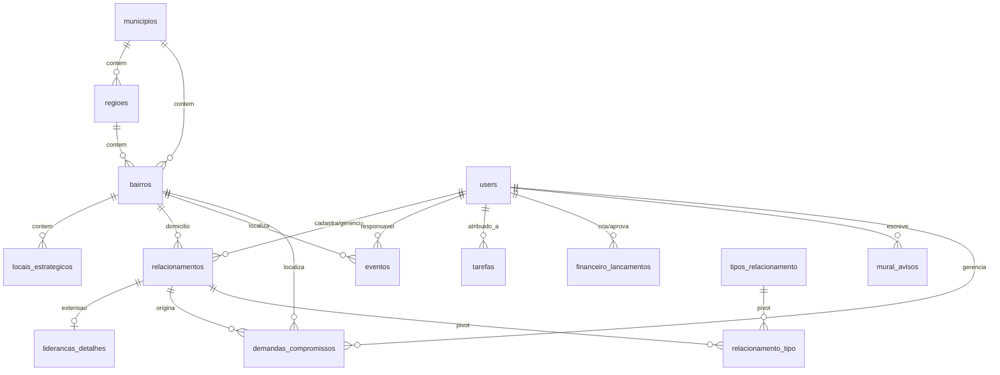

# DATABASE_SCHEMA — Modelo de Dados do MVP

O banco de dados do CampaignOS MVP será relacional (SQLite local para desenvolvimento, PostgreSQL/MySQL para produção). Abaixo estão descritas as tabelas, tipos e chaves estrangeiras.

---

## 1. Diagrama de Relacionamento Simplificado (ER)

---

## 2. Detalhamento das Tabelas

### 2.1. Tabela: `users`
Armazena os usuários que operam o sistema (equipe interna de campanha).
*   `id` (BigIncrements, PK)
*   `name` (VARCHAR(150), obrigatório)
*   `email` (VARCHAR(100), único, obrigatório)
*   `password` (VARCHAR(255), obrigatório)
*   `role` (Spatie RBAC, dinâmico)
*   `status` (VARCHAR(20), padrão `ativo`): `ativo`, `inativo`.
*   `telefone` (VARCHAR(20), opcional)
*   `remember_token` (VARCHAR(100), opcional)
*   `criado_por` (BIGINT, FK -> `users.id`, opcional)
*   `timestamps`

### 2.2. Tabela: `relacionamentos`
Cadastro unificado de contatos do CRM de campanha.
*   `id` (BigIncrements, PK)
*   `nome` (VARCHAR(150), obrigatório)
*   `apelido` (VARCHAR(100), opcional)
*   `tipo_pessoa` (VARCHAR(2), padrão `PF`): `PF` (Pessoa Física), `PJ` (Pessoa Jurídica)
*   `cpf_cnpj` (VARCHAR(20), opcional)
*   `email` (VARCHAR(100), opcional)
*   `telefone` (VARCHAR(20), opcional)
*   `telefone_normalizado` (VARCHAR(20), opcional): Usado para prevenção inteligente de duplicidades.
*   `data_nascimento` (DATE, opcional)
*   `genero` (VARCHAR(20), opcional)
*   `profissao` (VARCHAR(100), opcional)
*   `endereco` (VARCHAR(255), opcional)
*   `bairro_id` (BIGINT, FK -> `bairros.id`, opcional)
*   `responsavel_id` (BIGINT, FK -> `users.id`, opcional)
*   `data_proxima_acao` (DATE, opcional)
*   `descricao_proxima_acao` (TEXT, opcional)
*   `status` (VARCHAR(20), padrão `ativo`): `ativo`, `inativo`.
*   `timestamps`

### 2.3. Tabela: `tipos_relacionamento`
Segmentações extensíveis administráveis para contatos (Requisito CRM N:N).
*   `id` (BigIncrements, PK)
*   `nome` (VARCHAR(100), único, obrigatório): `apoiador`, `voluntario`, `lideranca`, `equipe`, `jornalista`, `fornecedor`.
*   `descricao` (VARCHAR(255), opcional)
*   `ativo` (BOOLEAN, padrão TRUE)
*   `timestamps`

### 2.4. Tabela Pivot: `relacionamento_tipo`
*   `relacionamento_id` (BIGINT, FK -> `relacionamentos.id`, PK, cascade)
*   `tipo_relacionamento_id` (BIGINT, FK -> `tipos_relacionamento.id`, PK, cascade)

### 2.5. Tabela: `liderancas_detalhes`
Campos estendidos de influência e estimativas de votos de lideranças locais.
*   `id` (BigIncrements, PK)
*   `relacionamento_id` (BIGINT, FK -> `relacionamentos.id`, cascade)
*   `area_influencia` (VARCHAR(255), opcional)
*   `votos_estimados` (INTEGER, padrão 0): Quantidade avaliada.
*   `data_estimativa` (DATE, opcional)
*   `responsavel_estimativa_id` (BIGINT, FK -> `users.id`, null on delete)
*   `justificativa` (TEXT, opcional)
*   `nivel_confianca` (VARCHAR(20), opcional): `alto`, `medio`, `baixo`
*   `observacoes_influencia` (TEXT, opcional)
*   `timestamps`

### 2.6. Tabela: `municipios`
Cadastro de divisões territoriais.
*   `id` (BigIncrements, PK)
*   `nome` (VARCHAR(150), obrigatório)
*   `estado` (CHAR(2), obrigatório)
*   `codigo_ibge` (VARCHAR(20), opcional)
*   `municipio_principal` (BOOLEAN, padrão FALSE)
*   `ativo` (BOOLEAN, padrão TRUE)
*   `timestamps`

### 2.7. Tabela: `regioes`
Regiões administrativas de cada município.
*   `id` (BigIncrements, PK)
*   `municipio_id` (BIGINT, FK -> `municipios.id`, cascade)
*   `nome` (VARCHAR(100), obrigatório)
*   `descricao` (TEXT, opcional)
*   `responsavel_id` (BIGINT, FK -> `users.id`, null on delete)
*   `ativo` (BOOLEAN, padrão TRUE)
*   `timestamps`

### 2.8. Tabela: `bairros`
Subdivisões de bairros com status de cobertura.
*   `id` (BigIncrements, PK)
*   `municipio_id` (BIGINT, FK -> `municipios.id`, cascade)
*   `regiao_id` (BIGINT, FK -> `regioes.id`, cascade)
*   `nome` (VARCHAR(150), obrigatório)
*   `nome_alternativo` (VARCHAR(150), opcional)
*   `prioridade` (VARCHAR(20), padrão `normal`): `estrategica`, `alta`, `normal`, `baixa`
*   `responsavel_id` (BIGINT, FK -> `users.id`, null on delete)
*   `populacao_estimada_manual` (INTEGER, padrão 0)
*   `meta_contatos` (INTEGER, padrão 0)
*   `observacoes` (TEXT, opcional)
*   `data_ultima_acao` (DATE, opcional)
*   `data_proxima_acao` (DATE, opcional)
*   `status_cobertura` (VARCHAR(30), padrão `nao_iniciado`): `nao_iniciado`, `em_mapeamento`, `em_aproximacao`, `ativo`, `consolidado`, `precisa_retornar`, `suspenso`
*   `ativo` (BOOLEAN, padrão TRUE)
*   `timestamps`

### 2.9. Tabela: `locais_estrategicos`
Pontos comerciais, feiras ou praças públicas dentro de bairros.
*   `id` (BigIncrements, PK)
*   `nome` (VARCHAR(150), obrigatório)
*   `tipo` (VARCHAR(50), obrigatório): `comercio`, `feira`, `praca`, `associacao`, `escola`, `religioso`, `condominio`, `outro`
*   `endereco` (VARCHAR(255), opcional)
*   `bairro_id` (BIGINT, FK -> `bairros.id`, cascade)
*   `contato_responsavel` (VARCHAR(150), opcional)
*   `telefone` (VARCHAR(20), opcional)
*   `observacoes` (TEXT, opcional)
*   `nivel_prioridade` (VARCHAR(20), padrão `normal`): `alta`, `normal`, `baixa`
*   `data_ultima_visita` (DATE, opcional)
*   `proxima_acao` (VARCHAR(255), opcional)
*   `status` (VARCHAR(20), padrão `ativo`): `ativo`, `inativo`
*   `timestamps`

### 2.10. Tabela: `demandas_compromissos`
Demandas da população e compromissos formais assumidos pela campanha.
*   `id` (BigIncrements, PK)
*   `titulo` (VARCHAR(150), obrigatório)
*   `descricao` (TEXT, obrigatório)
*   `tipo` (VARCHAR(50), obrigatório): `demanda`, `solicitacao_reuniao`, `pedido_visita`, `problema_bairro`, `oferta_ajuda`, `promessa_apoio`, `compromisso_campanha`, `oportunidade`, `problema_operacional`, `outro`
*   `contato_relacionado_id` (BIGINT, FK -> `relacionamentos.id`, null on delete)
*   `lideranca_relacionada_id` (BIGINT, FK -> `relacionamentos.id`, null on delete)
*   `bairro_relacionado_id` (BIGINT, FK -> `bairros.id`, null on delete)
*   `evento_relacionado_id` (BIGINT, FK -> `eventos.id`, null on delete)
*   `responsavel_interno_id` (BIGINT, FK -> `users.id`, null on delete)
*   `origem` (VARCHAR(100), opcional)
*   `data_registro` (DATE, obrigatório)
*   `prazo` (DATE, opcional)
*   `prioridade` (VARCHAR(20), padrão `normal`): `critica`, `alta`, `normal`, `baixa`
*   `status` (VARCHAR(20), padrão `novo`): `novo`, `em_analise`, `aprovado`, `em_andamento`, `aguardando_terceiro`, `concluido`, `cancelada`, `nao_atendido`
*   `proxima_acao` (VARCHAR(255), opcional)
*   `data_proxima_acao` (DATE, opcional)
*   `resultado` (TEXT, opcional)
*   `motivo_cancelamento` (TEXT, opcional)
*   `observacoes_publicas` (TEXT, opcional)
*   `observacoes_internas` (TEXT, opcional): Restrito a perfis autorizados.
*   `aprovado_por_id` (BIGINT, FK -> `users.id`, null on delete)
*   `data_aprovacao` (DATETIME, opcional)
*   `texto_anterior` (TEXT, opcional)
*   `texto_aprovado` (TEXT, opcional)
*   `timestamps`

### 2.11. Tabela: `eventos`
Compromissos de agenda do candidato e mobilizações.
*   `id` (BigIncrements, PK)
*   `titulo` (VARCHAR(150), obrigatório)
*   `tipo` (VARCHAR(50), obrigatório): `caminhada`, `reuniao`, `entrevista`, `visita`, `gravacao`, `comicio` etc.
*   `descricao` (TEXT, opcional)
*   `data_hora_inicio` (DATETIME, obrigatório)
*   `data_hora_fim` (DATETIME, obrigatório)
*   `endereco` (VARCHAR(255), opcional)
*   `bairro_id` (BIGINT, FK -> `bairros.id`, null on delete)
*   `responsavel_id` (BIGINT, FK -> `users.id`, null on delete)
*   `prioridade` (VARCHAR(20), padrão `importante`): `obrigatoria`, `importante`, `opcional`
*   `status` (VARCHAR(20), padrão `solicitado`): `solicitado`, `em_analise`, `confirmado`, `realizado`, `cancelado`
*   `tempo_deslocamento_manual` (INTEGER, padrão 0)
*   `custo_estimado` (DECIMAL(10,2), padrão 0.00)
*   `checklist` (JSON, opcional)
*   `timestamps`

### 2.12. Tabela: `tarefas`
Tarefas internas da equipe da campanha.
*   `id` (BigIncrements, PK)
*   `titulo` (VARCHAR(150), obrigatório)
*   `descricao` (TEXT, opcional)
*   `responsavel_id` (BIGINT, FK -> `users.id`, null on delete)
*   `data_inicio` (DATE, opcional)
*   `prazo` (DATE, opcional)
*   `prioridade` (VARCHAR(20), padrão `normal`): `critica`, `alta`, `normal`, `baixa`
*   `status` (VARCHAR(20), padrão `pendente`): `pendente`, `em_andamento`, `concluida`, `cancelada`
*   `checklist` (JSON, opcional)
*   `relacionado_type` (VARCHAR(100), opcional): Polimórfico (bairro, relacionamento, evento)
*   `relacionado_id` (BIGINT, opcional): Polimórfico
*   `timestamps`

### 2.13. Tabela: `mural_avisos`
Mural interno de avisos.
*   `id` (BigIncrements, PK)
*   `titulo` (VARCHAR(150), obrigatório)
*   `mensagem` (TEXT, obrigatório)
*   `autor_id` (BIGINT, FK -> `users.id`, obrigatório)
*   `prioridade` (VARCHAR(20), padrão `informativo`): `critico`, `atencao`, `informativo`
*   `data_inicio` (DATE, obrigatório)
*   `data_expiracao` (DATE, opcional)
*   `fixado` (BOOLEAN, padrão FALSE)
*   `anexo_path` (VARCHAR(255), opcional)
*   `timestamps`

### 2.14. Tabela: `logs_auditoria`
Auditoria de ações administrativas.
*   `id` (BigIncrements, PK)
*   `user_id` (BIGINT, FK -> `users.id`, null on delete)
*   `acao` (VARCHAR(50), obrigatório): `login`, `logout`, `criacao`, `edicao`, `exclusao`, `aprovacao_compromisso` etc.
*   `tabela` (VARCHAR(50), opcional)
*   `registro_id` (BIGINT, opcional)
*   `dados_alterados` (TEXT, opcional): Histórico de campos alterados (de/para) em JSON/Texto.
*   `ip_origem` (VARCHAR(45), opcional)
*   `dispositivo` (VARCHAR(255), opcional)
*   `timestamps` (criado_em apenas)

### 2.15. Tabela: `timeline`
Registra eventos marcantes da campanha exibidos no War Room.
*   `id` (BigIncrements, PK)
*   `tipo_evento` (VARCHAR(50), obrigatório)
*   `titulo` (VARCHAR(150), obrigatório)
*   `descricao` (TEXT, opcional)
*   `user_id` (BIGINT, FK -> `users.id`, null on delete)
*   `relacionado_type` (VARCHAR(100), opcional): Polimórfico
*   `relacionado_id` (BIGINT, opcional): Polimórfico
*   `timestamps`

### 2.16. Tabela: `campanhas_tematicas`
Campanhas e frentes temáticas prioritárias da campanha digital.
*   `id` (BigIncrements, PK)
*   `titulo` (VARCHAR(150), obrigatório)
*   `descricao` (TEXT, opcional)
*   `status` (VARCHAR(20), padrão `planejado`)
*   `timestamps`

### 2.17. Tabela: `banco_pautas`
Ideias e pautas de marketing e assessoria.
*   `id` (BigIncrements, PK)
*   `titulo` (VARCHAR(150), obrigatório)
*   `descricao` (TEXT, opcional)
*   `origem` (VARCHAR(50))
*   `tema` (VARCHAR(100))
*   `prioridade` (VARCHAR(20))
*   `responsavel_id` (BIGINT, FK -> `users.id`, null on delete)
*   `status` (VARCHAR(30))
*   `prazo` (DATE, opcional)
*   `timestamps`

### 2.18. Tabela: `conteudos_marketing`
Fila editorial e métricas manuais de publicações.
*   `id` (BigIncrements, PK)
*   `pauta_origem_id` (BIGINT, FK -> `banco_pautas.id`, null on delete)
*   `titulo` (VARCHAR(150), obrigatório)
*   `tipo` (VARCHAR(50), obrigatório)
*   `prioridade` (VARCHAR(20))
*   `roteiro_texto` (TEXT)
*   `chamada_principal` (VARCHAR(255))
*   `status` (VARCHAR(35))
*   `data_criacao` (DATE)
*   `prazo` (DATE)
*   `data_prevista_gravacao` (DATE, opcional)
*   `data_prevista_publicacao` (DATE, opcional)
*   `canais` (JSON)
*   `link_publicacao` (VARCHAR(255), opcional)
*   `aprovado_por_id` (BIGINT, FK -> `users.id`, null on delete)
*   `texto_approved` (TEXT, opcional)
*   `metricas_visualizacoes` (INTEGER)
*   `metricas_alcance` (INTEGER)
*   `metricas_curtidas` (INTEGER)
*   `metricas_comentarios` (INTEGER)
*   `metricas_compartilhamentos` (INTEGER)
*   `metricas_salvamentos` (INTEGER)
*   `metricas_cliques` (INTEGER)
*   `metricas_mensagens` (INTEGER)
*   `metricas_contatos_gerados` (INTEGER)
*   `metricas_desempenho_obs` (TEXT, opcional)
*   `timestamps`

### 2.19. Tabela: `veiculos_imprensa`
Mídias, rádios e canais de imprensa de Limeira e região.
*   `id` (BigIncrements, PK)
*   `nome` (VARCHAR(150), obrigatório)
*   `tipo` (VARCHAR(50))
*   `cidade` (VARCHAR(100))
*   `responsavel_nome` (VARCHAR(100))
*   `responsavel_telefone` (VARCHAR(20))
*   `responsavel_email` (VARCHAR(100))
*   `ativo` (BOOLEAN)
*   `timestamps`

### 2.20. Tabela: `solicitacoes_imprensa`
Pedidos de posicionamento ou entrevistas enviados pelos veículos.
*   `id` (BigIncrements, PK)
*   `veiculo_id` (BIGINT, FK -> `veiculos_imprensa.id`)
*   `pauta` (TEXT)
*   `data_recebida` (DATE)
*   `prazo_resposta` (DATETIME)
*   `responsavel_id` (BIGINT, FK -> `users.id`)
*   `resposta_enviada` (TEXT, opcional)
*   `status` (VARCHAR(25))
*   `timestamps`

### 2.21. Tabela: `entrevistas`
Briefings estratégicos confidenciais e agendas de entrevistas.
*   `id` (BigIncrements, PK)
*   `veiculo_id` (BIGINT, FK -> `veiculos_imprensa.id`)
*   `jornalista_id` (BIGINT, FK -> `relacionamentos.id`, null on delete)
*   `pauta` (TEXT)
*   `data` (DATE)
*   `horario` (VARCHAR(10))
*   `local_link` (VARCHAR(255))
*   `responsavel_id` (BIGINT, FK -> `users.id`, null on delete)
*   `porta_voz` (VARCHAR(150))
*   `status` (VARCHAR(25))
*   `briefing` (TEXT, confidencial)
*   `perguntas_provaveis` (TEXT, opcional)
*   `pontos_atencao` (TEXT, opcional)
*   `respostas_sugeridas` (TEXT, opcional)
*   `assuntos_evitar` (TEXT, opcional)
*   `timestamps`

### 2.22. Tabela: `materiais`
Cadastro de materiais físicos de campanha (santinhos, praguinhas, bandeiras, etc.).
*   `id` (BigIncrements, PK)
*   `nome` (VARCHAR(150), obrigatório)
*   `categoria` (VARCHAR(50))
*   `quantidade_atual` (INTEGER)
*   `quantidade_minima` (INTEGER)
*   `unidade` (VARCHAR(20))
*   `estado_conservacao` (VARCHAR(50))
*   `valor_estimado` (DECIMAL(10,2))
*   `ativo` (BOOLEAN)
*   `timestamps`

### 2.23. Tabela: `materiais_movimentacoes`
Histórico de entradas, saídas, perdas e retiradas do almoxarifado.
*   `id` (BigIncrements, PK)
*   `material_id` (BIGINT, FK -> `materiais.id`)
*   `tipo_movimentacao` (VARCHAR(20))
*   `quantidade` (INTEGER)
*   `responsavel_id` (BIGINT, FK -> `users.id`)
*   `evento_id` (BIGINT, FK -> `eventos.id`, null on delete)
*   `observacoes` (TEXT, opcional)
*   `timestamps`

### 2.24. Tabela: `kits`
Kits operacionais de panfletagem pré-configurados.
*   `id` (BigIncrements, PK)
*   `nome` (VARCHAR(150), obrigatório)
*   `descricao` (TEXT, opcional)
*   `timestamps`

### 2.25. Tabela: `arquivos`
Metadados da Biblioteca de Arquivos (links externos ou uploads de < 5MB).
*   `id` (BigIncrements, PK)
*   `nome` (VARCHAR(150), obrigatório)
*   `categoria` (VARCHAR(50))
*   `is_link_externo` (BOOLEAN)
*   `link_url` (VARCHAR(255), opcional)
*   `arquivo_path` (VARCHAR(255), opcional)
*   `tamanho_bytes` (BIGINT, opcional)
*   `mime_type` (VARCHAR(100), opcional)
*   `criado_por_id` (BIGINT, FK -> `users.id`)
*   `versao` (INTEGER, padrão 1)
*   `tags` (VARCHAR(255), opcional)
*   `timestamps`

### 2.26. Tabela: `arquivos_versoes`
Versionamento histórico de discursos, releases e documentos.
*   `id` (BigIncrements, PK)
*   `arquivo_id` (BIGINT, FK -> `arquivos.id`, cascade)
*   `versao` (INTEGER)
*   `arquivo_path` (VARCHAR(255))
*   `tamanho_bytes` (BIGINT)
*   `criado_por_id` (BIGINT, FK -> `users.id`)
*   `observacao` (TEXT, opcional)
*   `timestamps`

### 2.27. Tabela: `favoritos`
Transversal: Registros favoritados polimorficamente por usuário.
*   `id` (BigIncrements, PK)
*   `user_id` (BIGINT, FK -> `users.id`, cascade)
*   `favoritavel_type` (VARCHAR(100))
*   `favoritavel_id` (BIGINT)
*   `timestamps`

### 2.28. Tabela: `historico_recente`
Transversal: Últimos registros individuais visitados por cada usuário da equipe.
*   `id` (BigIncrements, PK)
*   `user_id` (BIGINT, FK -> `users.id`, cascade)
*   `acessavel_type` (VARCHAR(100))
*   `acessavel_id` (BIGINT)
*   `titulo` (VARCHAR(150))
*   `url` (VARCHAR(255))
*   `visited_at` (TIMESTAMP)
*   `timestamps`
